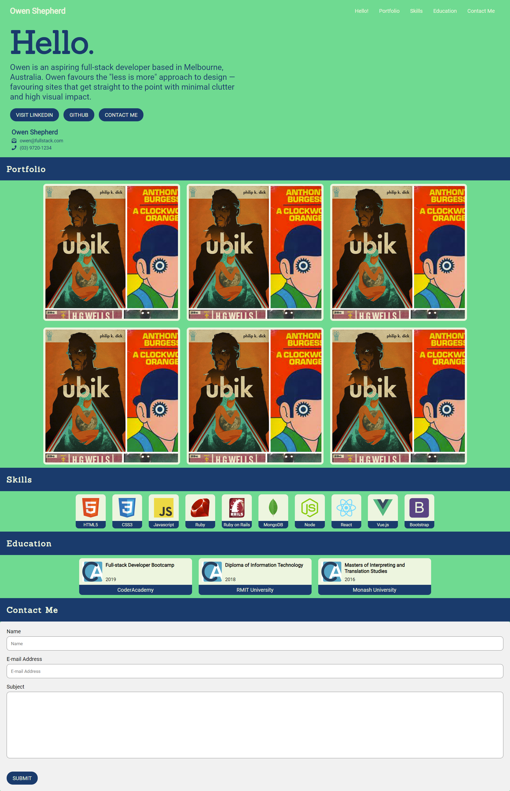
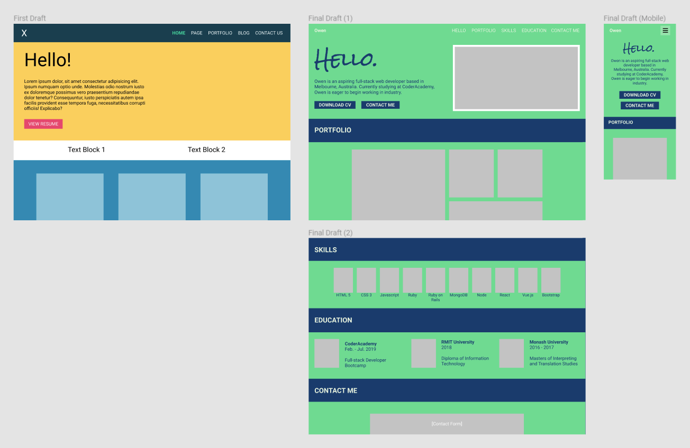
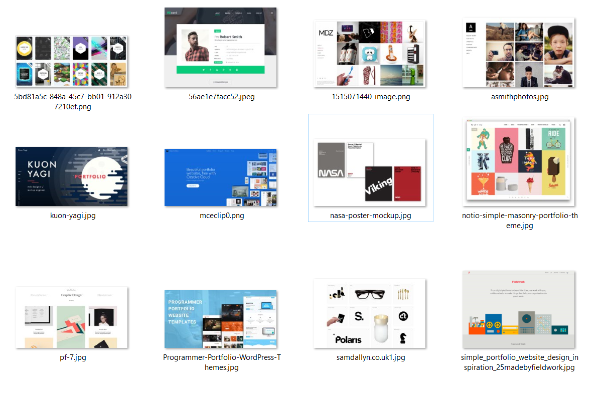
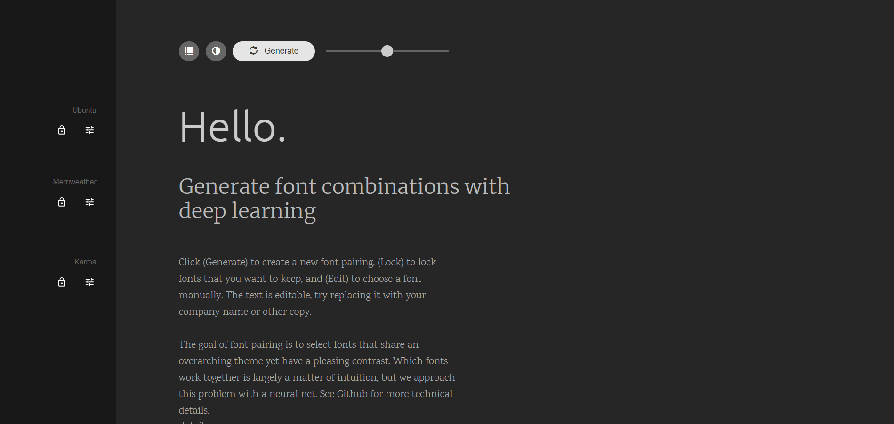
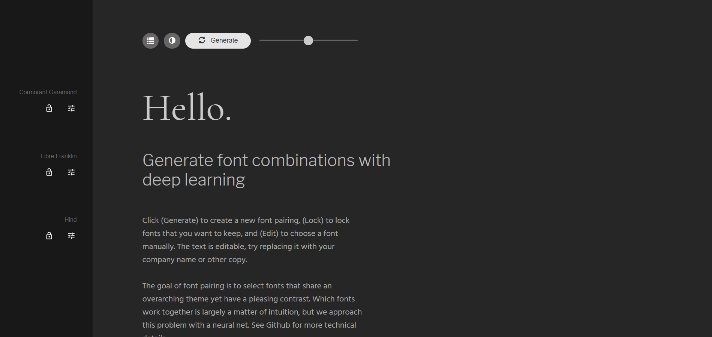
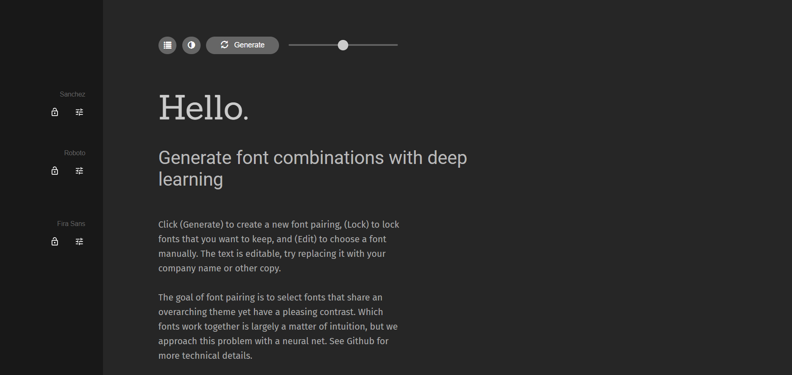
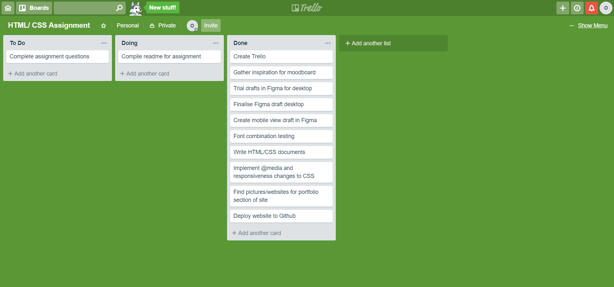

# Readme for Owen Shepherd #
## owshepherd.github.io ##

### Link to GitHub repository ###
[https://github.com/owshepherd/owshepherd.github.io](https://github.com/owshepherd/owshepherd.github.io "GitHub Repository")

### Link to deployed website ###
[https://owshepherd.github.io](https://owshepherd.github.io "Deployed website via GitHub Pages")

## Description of your portfolio website ##
### Purpose ###
The purpose of my portfolio website is to generate interest among clients and/or potential employers, and showcase my previous work.

### Functionality and features ###
From the onset, my goal was to create a portfolio website that was visually interesting to visitors but was simplstic and lacked any needless stylistic additions. For example, while parallex images are great from a stylistic standpoint and help to create visual interest in a site, they add a lot of height to a page which forces visitors to scroll more than would otherwise be necessary. As such, while creating my portfolio website I have attempted to forgo needless flair and instead opted for a single page site, utilising page jumps to navigate between different sections.
The navigation bar found at the top of the page is hidden when the website is viewed below a certain width. Given that this is a single page site, I felt that implementing a hamburger menu or other hidden navigation option was unnecessary. Furthermore, I was reluctant to implement Javascript features to the site for worry that I would be jumping too far ahead of the lesson plan.
One issue I have about my site, however, is the alignment of badges used in the "Skills" section of the website. With the use of flexbox, this section can sometimes look a little messy depending on how the resolution is sized. A solution to this would be to use CSS to force a line break after a certain number of items appear in a row (which I have done). However, the code used (page-break and page-break-after) are currently only supported by Mozilla Firefox.

It should be noted that at present, the images beind used as part of my portfolio are not my own works and are simply used as a placeholder to demonstrate the portfolio site itself.

### Sitemap ###
```xml
<?xml version="1.0" encoding="UTF-8"?>
<urlset xsi:schemaLocation="http://www.sitemaps.org/schemas/sitemap/0.9 http://www.sitemaps.org/schemas/sitemap/0.9/sitemap.xsd" xmlns:xsi="http://www.w3.org/2001/XMLSchema-instance" xmlns="http://www.sitemaps.org/schemas/sitemap/0.9">
<url>
<loc>https://owshepherd.github.io/</loc>
<lastmod>2019-03-24T01:20:51+00:00</lastmod>
</url>
</urlset>
```

### Screenshots ###


### Target Audience ###
The target audience would largely be those I have contacted regarding employment who are interested in seeing the previous work I have completed. Secondary to that would be those who are interested in my work for a non employment-related reason. A lot of the inspiration for the simplicity of the site is derived from most employers and their HR/hiring team's interest in time efficienccy.

### Tech stack ###
* HTML
* CSS
* GitHub
* GitHub Pages

## Design documentation ##
### Figma Screenshots ###


### Moodboard and Design Process Screenshots ###
#### Moodboard ####


#### Font Testing via FontJoy ####




## Details of planning process ##
### Project plan and timeline ###
As mentioned previously, my goal was to create a portfolio website that was visually interesting to visitors but was simplstic and lacked any needless stylistic additions from the onset. In order to mimise time spent tweaking the website unnecessarily, a draft (wireframe) was created in Figma based on the layout of existing developer portfolio websites (see Moodboard). One completed, the HTML and CSS was to be created. Javascript kept to a minimum if appear at all due to concerns regarding "jumping ahead", re: CoderAcademy learning curriculum. Furthermore, it seemed largely unneecssary given the single page layout.

A time frame of approx. 6 days was given to complete the website; this included creating draft, compiling a moodboard, completing a readme file and creating the site itself. steps taken throughout the course of this site's development can be found below (see Trello).

### Trello Board Screenshots ###


## Short answer Q&A ##
### Describe key events in the development of the internet from the 1980s to today (max. 150 words) ###
The internet began in the late 1960s following the connection of UCLA and Stanford via ARPANET. By 1983, all hosts connected via ARPANET (largely universities) were switched over to a TCP/IP system. 
During this time, BBS (Bullet Board System) became popular and rose to prominence following their use with commercial services such as America Online. BBS were largely run by individuals and were comparable to the modern day forum.
The internet went public in 1994. At this time, the capabilities of HTML were extremely limited. Tech stack at this time also included ASP, PHP, Java, Javascript and ActiveX. The concept behind what is now CSS was also proposed in this year.
Web 2.0 emerged following the dot-com bubble in 2003. The tech stack of this time expanded to include Flash, CGI, .NET and others. Social websites (which had existed since the nineties) came to the forefront with the popularity of MySpace in 2005.

### Define and describes the relationship between fundamental aspects of the internet such as: domains, web servers, DNS, and web browsers (max. 150 words) ###
Domain: A domain name is a web address (or a URL).
Web server: Web servers are computers (servers) located in Data Centers which, in term, are operated by hosting companies. These servers store websites to be visited via the internet.
DNS (Domain Name System) translates a website name into an IP addres that tells which server is hosting the site. In the case of e-mail, it also tells other email servers where the e-mail is to be sent.
Web browser: The web browser will read the files stored on web servers, converting them into text and images to be viewed by the user. These files are sourced after the browser communicates with the web server.

### Reflect on one aspect of the development of internet technologies and how it has contributed to the world today (max. 150 words) ###
The development of internet technologies has changed the state of the retail market - both in terms of the brick-and-mortar market and the online retailer market. With the prevalence of online alternatives to traditional retail, a majority of brick-and-mortar retailers now also have an online presence to maximise their market reach and the accessibility for their customers. These changes can be considered both a pro and a con - the pro being that retailers can expand their market and reach more customers via the internet, and sell more products to more people. The con being that these same retailers need to spend additional money for a website, goods distribution, etc.